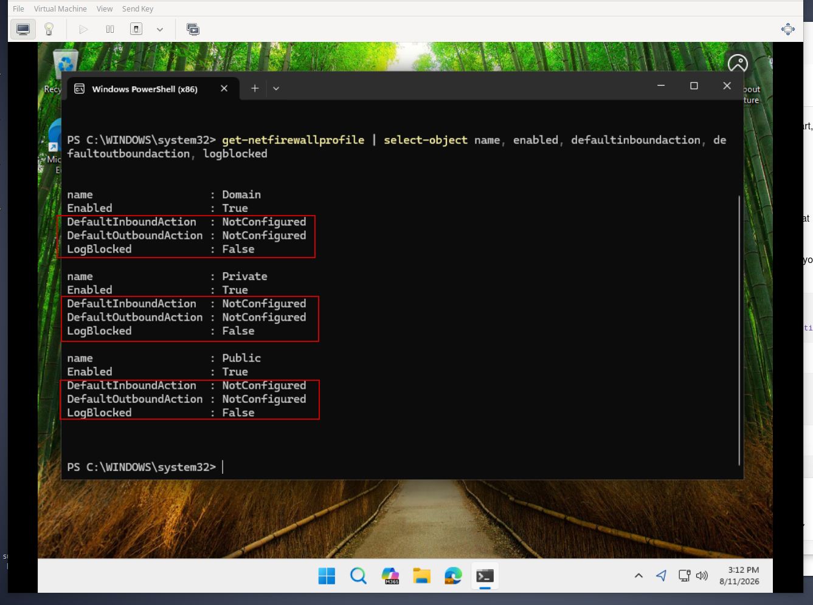
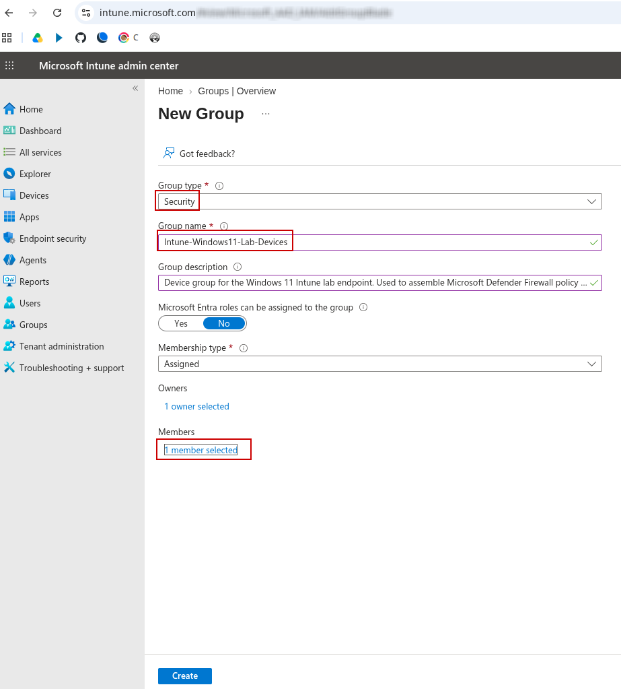
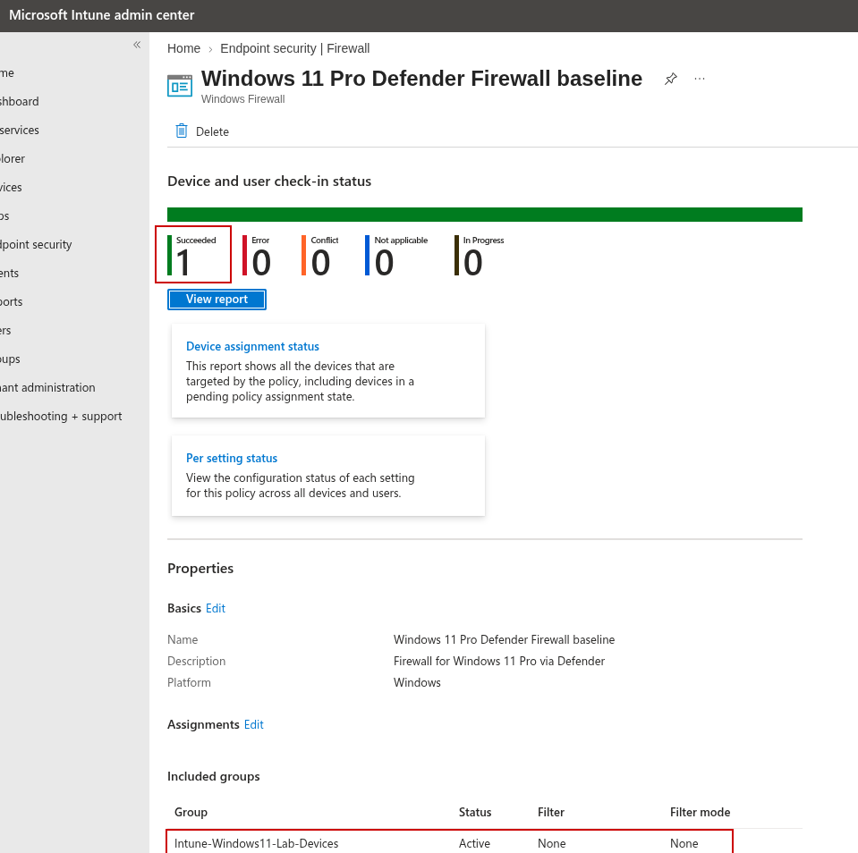
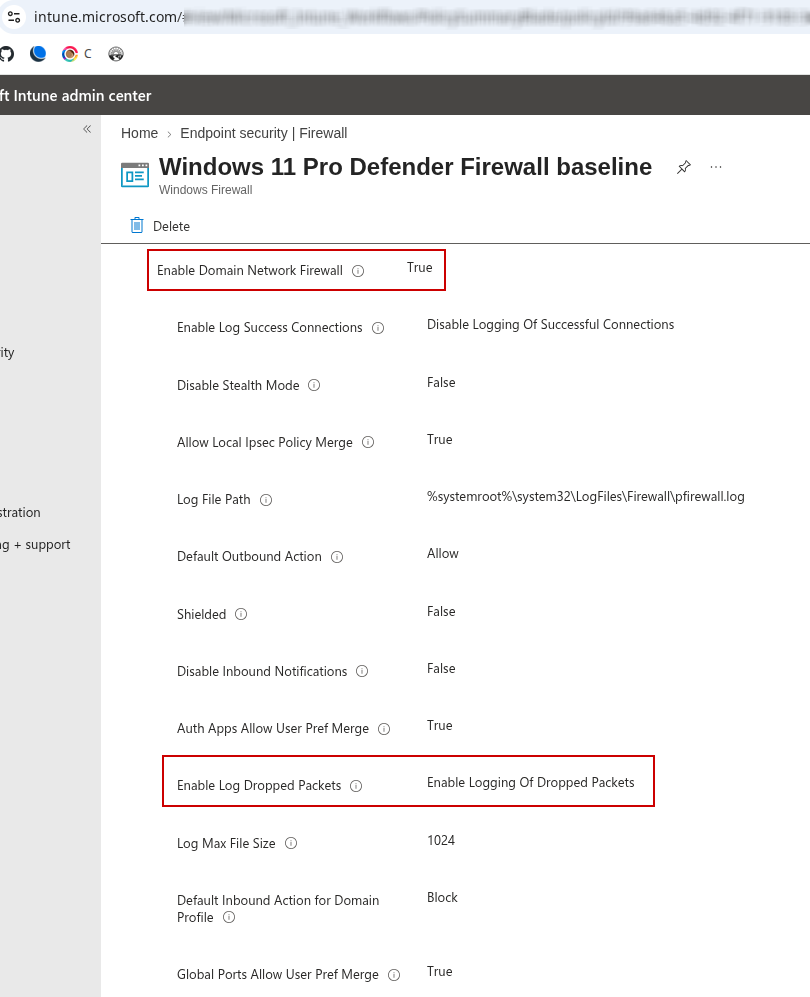
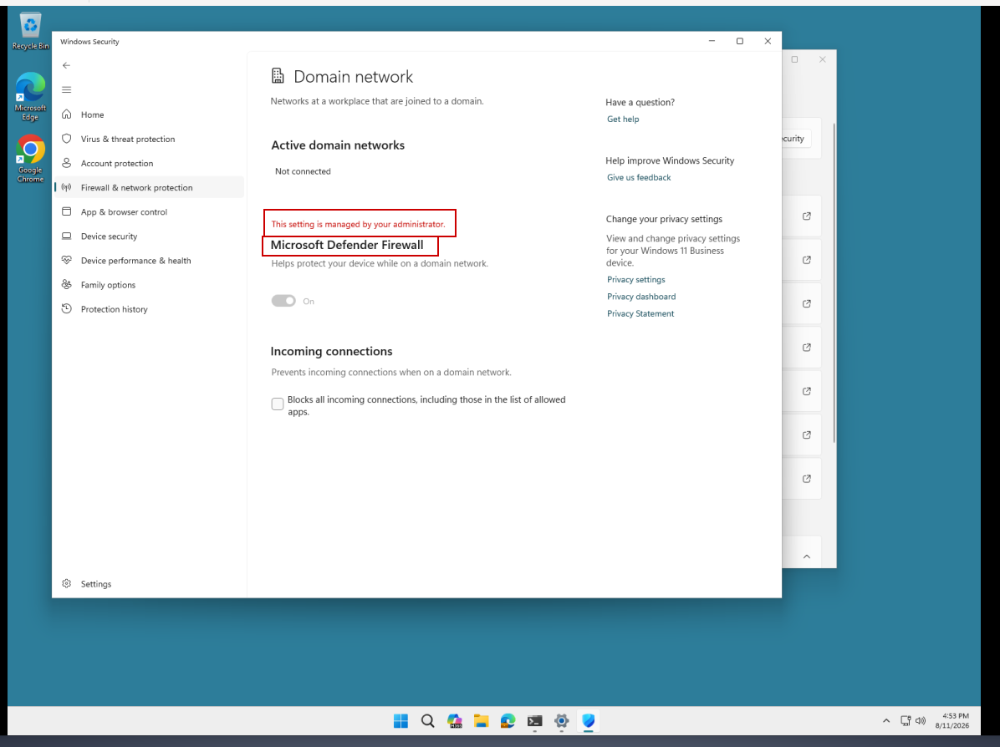
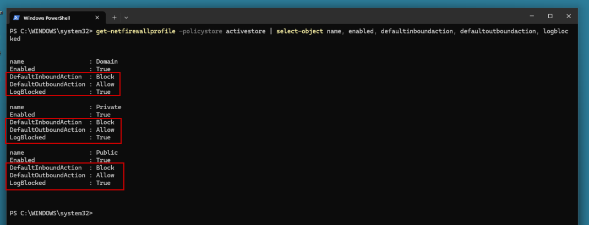

**Intune-Defender-Firewall-Management**

Microsoft Intune lab documenting centralized Microsoft Defender Firewall policy deployment, security-groups, and endpoint verification on a Windows 11 Pro virtual machine.

What happens when a business needs to configure and apply the same firewall security settings across 50, 100, or even more Windows endpoint devices? Configuring all of those devices individually would create a large amount of unnecessary administrative overhead and increase the chance of error or inconsistent settings being applied across the environment.

Centralized endpoint management allows a business to define the desired security configuration once, target the appropriate business devices through security groups, deploy the policy at scale, and then monitor and validate that those endpoints successfully received the security administration remotely. In this lab, I demonstrated and documented that process using Microsoft Intune and Microsoft Defender Firewall on a Windows 11 Pro endpoint running as a virtual machine through KVM on my Debian desktop.

I first created a security group for the endpoint, configured and deployed a centralized firewall policy, and confirmed successful delivery through Intune. I then validated the applied configuration in multiple ways using both GUI-based and CLI-based verification. This approach supports better standardization, reduces the risk of misconfiguration and configuration drift, improves administrative efficiency, and gives IT teams stronger visibility into whether the intended security settings are actually being applied across managed endpoint devices.

**Objectives**

- Establish a baseline of the Windows Defender Firewall configuration before applying centralized Intune management.
- Create a dedicated device security group to provide a clear target for the Windows 11 endpoint.
- Configure and deploy a Microsoft Defender Firewall policy through Microsoft Intune.
- Verify that the policy successfully reached the endpoint and became the effective configuration through Intune, Windows Security, the firewall GUI, and PowerShell.

**Baseline Firewall State**

* Establishes the Windows Defender Firewall state before centralized Intune policy management.
* Shows the Domain, Private, and Public firewall profiles were already enabled.
* Shows `DefaultInboundAction` and `DefaultOutboundAction` as `NotConfigured`.
* Shows `LogBlocked: False`, establishing that dropped-packet logging had not yet been configured through the Intune policy.

**Intune Device Security Group**

* Creates a Security group to target the Windows 11 lab endpoint with Intune policy.
* Uses assigned membership so the intended endpoint can be explicitly included.
* Confirms one device was selected as a member of the group.
* Provides a reusable group-based structure for centralized endpoint policy targeting.

**Windows Defender Firewall GUI Validation**

* Uses Windows Defender Firewall with Advanced Security to inspect the firewall configuration directly on the Windows endpoint.
* Confirms the Domain profile uses `Block (default)` for inbound connections.
* Confirms dropped-packet logging is enabled.
* Provides GUI-based evidence of the firewall configuration applied to the system.

**Intune Firewall Policy Settings**

* Reviews the Microsoft Defender Firewall settings configured through the Intune admin center.
* Confirms the Domain Network Firewall is enabled.
* Confirms dropped-packet logging is enabled for troubleshooting and security visibility.
* Documents the centrally defined firewall configuration within Microsoft Intune.

**Windows Security Administrator Management**

* Shows the firewall configuration from the managed Windows 11 endpoint.
* Windows Security reports that the Microsoft Defender Firewall setting is managed by an administrator.
* Demonstrates that Windows recognizes centrally applied organizational management of this firewall configuration.

**Intune Policy Deployment Success**

* Confirms the Windows 11 Pro Defender Firewall policy successfully reached the targeted endpoint.
* Shows one successful deployment with zero errors, conflicts, or deployments still in progress.
* Confirms the `Intune-Windows11-Lab-Devices` group is included in the policy assignment.
* Provides Intune-side confirmation that the policy deployment completed successfully.

**PowerShell ActiveStore Validation**

* Queries the Windows Firewall `ActiveStore` to validate the effective system-level firewall configuration.
* Confirms Domain, Private, and Public firewall profiles are enabled.
* Verifies the effective inbound action is `Block` and the outbound action is `Allow` across all three profiles.
* Confirms `LogBlocked: True`, demonstrating that dropped-packet logging became active.
* Provides final command-line verification of the effective firewall policy on the endpoint.

**Lessons Learned**

- Learned that centralized endpoint management is not just about creating a policy. The full process includes defining the desired outcome, targeting the correct devices, deploying the policy, and verifying and validating the results.
- Used security groups and policy targeting as a scalable way to organize business endpoint devices and control which systems receive a particular configuration.
- Confirmed that a successful Intune deployment is important evidence, but followed the stronger practice of validating the configuration directly from the endpoint at the system level.
- Compared the original Get-NetFirewallProfile output, which showed several values as NotConfigured, with the ActiveStore, which showed the effective configuration that had been centrally applied.
- Reinforced the importance of checking the correct policy store and verifying that the Windows Firewall policy was properly configured, received, and active on the endpoint.
- Demonstrated that using multiple verification methods provides stronger evidence that a security policy was successfully applied remotely instead of relying on only one management-status view.

**Summary**

In this lab, I demonstrated how centralized endpoint management using Microsoft Intune can take a security setting that would otherwise need to be applied manually and turn it into a repeatable and scalable process. Instead of configuring one Windows device at a time, I used Microsoft Intune to configure the firewall policy, connected Intune to my Windows 11 endpoint, created a security group, added the endpoint to that group, and deployed the configuration remotely.

Consistency, efficiency, and visibility are important business values that come from using centralized management software such as Microsoft Intune. Centralized policy management for firewall settings, and for other IT-related configurations, reduces the chance of misconfiguration, helps reduce and mitigate configuration drift, and gives IT administrators a stronger and more secure way to manage settings across a business's endpoint devices.

I also validated the results directly from the Windows 11 endpoint using Windows Security, Windows Defender Firewall settings, and PowerShell commands. The goal was not just to deploy the policy. It was to demonstrate and prove that the intended configuration was received, applied properly, and became the effective configuration on the endpoint.

Navigation

[`Back to GitHub Profile`](https://www.github.com/cbueker-it)
