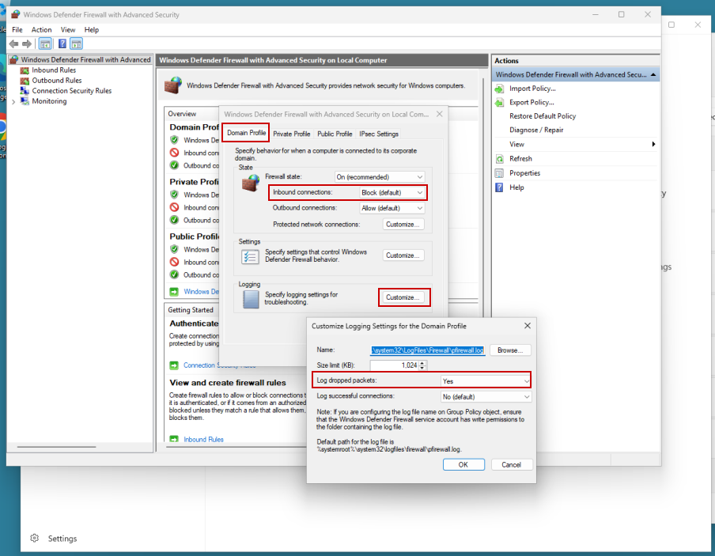

**Intune-Defender-Firewall-Management**

Microsoft Intune lab documenting centralized Microsoft Defender Firewall policy deployment, security-groups, and endpoint verification on a Windows 11 Pro virtual machine.

**Baseline Firewall State**

- Confirms the Domain, Private, and Public firewall profiles were enabled before the Intune policy was applied.
- Shows the default inbound and outbound actions as `NotConfigured`.
- Establishes that blocked-packet logging was disabled with `LogBlocked: False` before centralized configuration.

**Intune Defender Firewall Policy Configuration**

- Shows Microsoft Defender Firewall being configured through the Intune admin center.
- Enables the Domain firewall profile and applies a default inbound action of `Block`.
- Enables logging of dropped packets to improve visibility into blocked network traffic.
- Demonstrates centralized firewall configuration rather than manual endpoint-by-endpoint changes.

**Security Group and Device Targeting**

- Creates an assigned security group for the Windows 11 Intune lab endpoint.
- Uses device-group membership to define which endpoint receives the firewall policy.
- Demonstrates group-based targeting that can scale beyond configuration of a single device.

**Intune Policy Deployment Success**

- Confirms the Defender Firewall policy successfully checked in on one targeted endpoint.
- Shows zero policy errors, conflicts, or remaining deployments in progress.
- Confirms the Windows 11 lab security group is included in the policy assignment.
- Provides centralized administrative evidence that the policy was delivered successfully.

**Windows Security Administrative Control**

- Confirms Windows recognizes the firewall configuration as administrator-managed.
- Shows that the firewall setting is controlled centrally rather than only through local user configuration.
- Demonstrates the endpoint-side effect of applying Microsoft Intune management policy.

**Windows Defender Firewall GUI Validation**

- Verifies the effective Domain profile configuration through Windows Defender Firewall with Advanced Security.
- Confirms inbound connections use the `Block (default)` behavior.
- Confirms dropped-packet logging is enabled for the firewall profile.
- Provides GUI-based endpoint validation independent of the Intune administration portal.

**PowerShell ActiveStore Validation**

- Queries the Windows Firewall `ActiveStore` to verify the effective configuration applied to the endpoint.
- Confirms Domain, Private, and Public firewall profiles are enabled.
- Verifies default inbound traffic is blocked while default outbound traffic is allowed.
- Confirms blocked-packet logging is enabled across all three firewall profiles.
- Provides command-line validation that the centrally deployed Intune settings became the effective Windows firewall policy.

